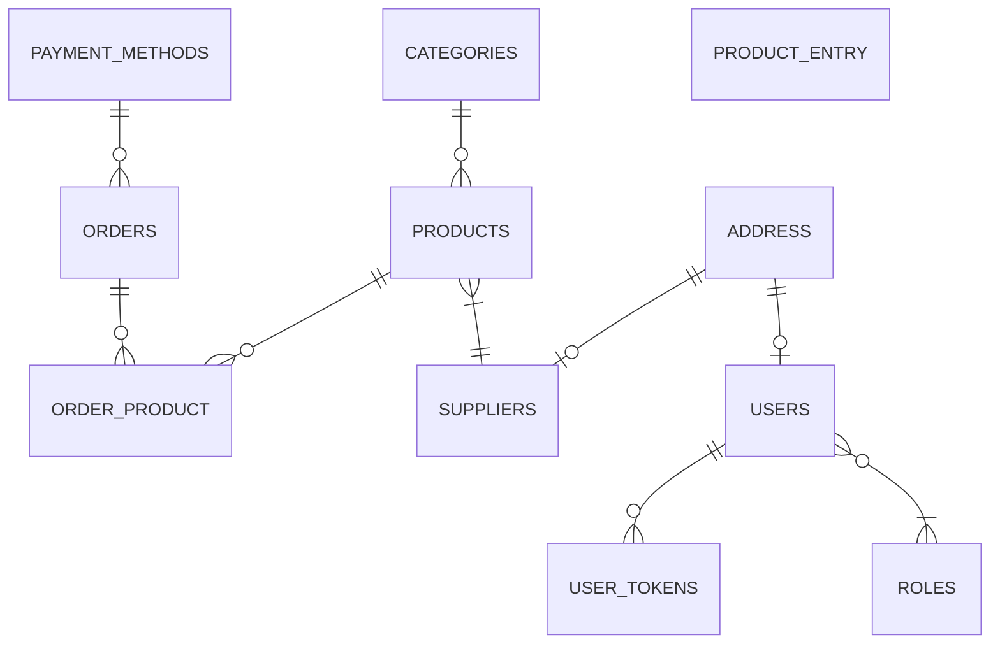

nodejs application that performs inventory control and manages online orders

## entity relationship diagram:



## Executing the Project

To run the project, use the following command:

```javascript

    npm run dev
```

## dependencies

-   [express](www.npmjs.com/package/express) 
-   [Prisma](https://www.prisma.io/)
-   [JWT](https://jwt.io)
-   [BCrypt](https://www.npmjs.com/package/bcrypt)
-   [JsonWebToken](www.npmjs.com/package/jsonwebtoken)
-   [tsyringe](www.npmjs.com/package/tsyringe)
-   [celebrate](www.npmjs.com/package/celebrate) 
-   [cors](www.npmjs.com/package/cors) 
-   [dayjs](www.npmjs.com/package/dayjs) 
-   [dotenv](www.npmjs.com/package/dotenv) 
-   [handlebars](www.npmjs.com/package/handlebars) 
-   [nodemailer](www.npmjs.com/package/nodemailer) 

<h3 align="center">Desenvolvido por  Delano Almeida filho </h3>